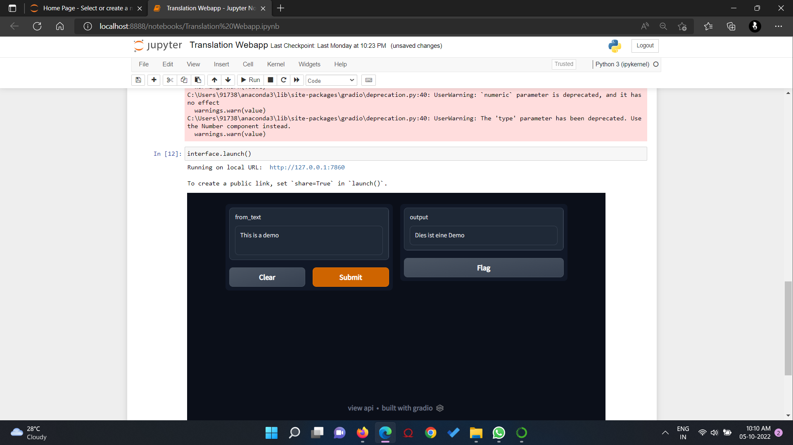

# ML-translator-webapp

ML translator is a machine learning model developed using pytorch library and gradios.

This translator converts text in english to German 

Pipelines from transformers are imported to translate from en to de 

Screenshots:

